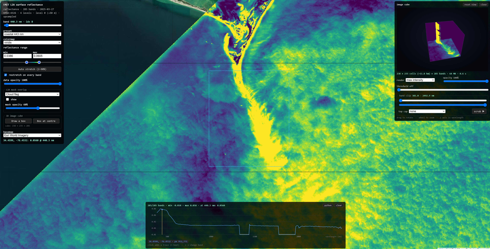

# Zarr Leaflet Viewers



**Landing page:** https://originaljsx.github.io/zarr-leaflet-viewers/

[](https://nasa-ammos.github.io/slim/?search=Badges)
[](https://nasa-ammos.github.io/slim/)
[](LICENSE)

Browser-only viewers for Zarr v3 multiscale pyramids. Each page is a single
HTML file with no backend: it fetches Zarr chunks directly over HTTP byte
ranges from CloudFront and renders them in Leaflet through `zarr-gl/`, a
custom WebGL layer written for this repo. There is no server, no tile cache,
and no build step — open a file, or serve the directory statically.

## Pages

- **`index.html`** — landing page linking the viewers below.
- **`swot-leaflet-gl.html`** — SWOT sea-surface height anomaly (`ssha`),
  absolute dynamic topography (`adt`), and normalized backscatter (`sig0`), at
  either the Expert 2 km or Unsmoothed 250 m resolution, through `zarr-gl`:
  one shared canvas and GL context, per-tile textures, no tile seams. A
  slider steps through passes with cycle/date/pass labels read from the
  store; clicking the map reports a value.
- **`mur-leaflet-gl.html`** — MUR SST 1 km, sea-surface temperature and
  anomaly, with a day slider, through `zarr-gl`: one shared canvas and GL
  context, per-tile textures, Mercator reprojection done per-fragment in the
  shader. No antimeridian gap and no north-south drift on zoom.
- **`arctic-leaflet-gl.html`** — SWOT data reprojected to EPSG:3413 (polar
  stereographic), also on `zarr-gl`, with pass/day/cycle mode switching and a
  bottom timeline control.
- **`tanager-leaflet-gl.html`** — Planet Tanager-1 hyperspectral surface
  reflectance, 426 bands from 376 to 2499 nm, on EPSG:3413 with the same CRS and
  GIBS basemaps as the arctic viewer (two extra zooms, since the data is 30 m).
  The band slider is a `wavelength` selector, so switching bands refetches only
  that band's chunks; clicking the scene plots the pixel's whole spectrum, read
  from a spectral-major copy of the cube on its native UTM grid — one chunk per
  spectrum, unresampled. Store built by `tanager_ic.export_gl` (the
  `hyperspectral` project) from an Icechunk spec-v2 repository; see "Tanager
  store layout" below.
- **`emit-leaflet-gl.html`** — EMIT L2A surface reflectance, 285 bands from 381 to
  2493 nm over Pamlico Sound / Cape Hatteras (2025-03-27). Unlike every other page
  here it reads an **Icechunk repository directly** — `zarr-source.js` routes the
  `.icechunk` URL through `icechunk-js`, so there is no plain-Zarr copy of the
  pixels. Level 0 is EMIT's own orthorectified grid (0.00054223°, ~60 m) built from
  the granule's GLT, so displayed values are the delivered radiometry, copied and
  never interpolated. The eight L2A mask bands (cloud, cirrus, water, spacecraft,
  dilated cloud, AOD550, H2O, aggregate) come along as a toggleable overlay driven
  by a `mask_band` selector; see "EMIT store layout" below. Draw a box on the map
  and that block of the scene is rendered as a **3D image cube** — see "The image
  cube" below.
- **`miost-currents-gl.html`** — MIOST/DUACS experimental L4 daily grid
  (multi-mission altimetry including SWOT) of absolute geostrophic velocity
  (`ugos_filtered`, `vgos_filtered`) as an animated particle field,
  Windy-style: a colour raster carries true speed and pale streaks carry
  direction. `tools/miost_l4_pyramid.py` writes a 4-level GeoZarr pyramid
  (zarr v3, OME-NGFF `multiscales`, int16 at 1 mm/s) holding `ugos`/`vgos`
  plus a precomputed `speed`, since the GL shader samples one variable. The
  speed raster renders straight from the pyramid through `zarr-gl`'s
  `ZarrGLLayer`, and the particles are fed by
  `currents/zarr-current-field.js`, which re-fetches only the viewport's
  chunks at the level the zoom resolves (padded, abortable) and wraps them in
  a `WindowField` with a `sample()` contract driving the shared
  `CurrentLayer`. At z3 the particle field rides level 2 at 0.5°/cell (~2
  chunks instead of ~18). `?store=<url>` points the page at another pyramid.

## zarr-gl/

A from-scratch WebGL2 Leaflet layer, built because `L.GridLayer`'s per-tile
canvases can't share a resampling pass and show seams at tile edges.

`zarr-gl/` is developed in parallel in its own (private) repo,
[`Originaljsx/leaflet-zarr-gl`](https://github.com/Originaljsx/leaflet-zarr-gl)
— it turned out to be reusable well beyond this repo's own viewers. The files
here are a **plain vendored copy**, not a git submodule, so GitHub Pages can
build this repo without needing auth to a second (private) repo. That means
changes currently have to be synced manually between the two — see that
repo's README for the design notes: why per-fragment projection instead of a
stretched texture, how tile size interacts with chunk size, and the
fallback/fade behavior while tiles are loading.

## EMIT store layout

`s3://swot-zarr/ice/emit_20250327_rfl_60m.icechunk` (3.5 GB, 11,357 objects,
Icechunk **spec v2**), written by `tanager_ic.emit` in this bucket's own
conventions — the `zarr_conventions` trio plus a `multiscales.layout` block, the
same shape `c42_43_expert_pyramid_v2.zarr` publishes:

```
/                       zarr_conventions [multiscales v1, geo-proj v1, spatial v1]
                        proj:code EPSG:4326, proj:wkt2, spatial:registration "pixel",
                        spatial:transform / :shape / :bbox, multiscales.layout[4],
                        zarr-layer {reflectance, mask}, EMIT provenance
  0/reflectance         (285, 1905, 2354) float32 NaN, chunks (1, 512, 512)   ~60 m
  0/mask                (8, 1905, 2354)   float32 NaN, chunks (1, 512, 512)
  0/{latitude,longitude,wavelength,fwhm,good_wavelengths,mask_band}
  1/ 2/ 3/              2x / 4x / 8x decimated (NaN-aware mean)
  spectra/reflectance   (285, 1905, 2354) float32, chunks (285, 24, 24)
```

This store exercises the *first* branch of `multiscaleLevels()` — per-level
`spatial:transform` + `spatial:shape` — where the Tanager store below exercises
the OME-style `datasets` branch. Both are read without changes to `zarr-gl`, and
`icechunk-js` opens the spec-v2 repo over plain HTTPS, so the page needs no
plain-Zarr export at all.

Worth knowing about the source data: EMIT's delivered GLT references 91.3% of the
valid swath pixels and repeats others (1.55 ortho cells per swath pixel), because
the ortho posting is finer than the swath IFOV. That is the granule's own
orthorectification, not something the converter introduces — the alternative
would be resampling, which would no longer be the delivered radiometry.

## The image cube

`cube-gl/cube-gl.js` renders a block of the scene as a volume: x is longitude,
y is latitude, **z is wavelength**. It is the browser answer to HyperCoast's
`image_cube`, which does the same things through PyVista, except the data
arrives as zarr chunks and nothing leaves the page:

| HyperCoast | here |
|---|---|
| default volume render | **volume (composite)**, the default mode |
| `widget="threshold"` | threshold slider — samples below it are ignored |
| `widget="orthogonal"` | orthogonal slices — three planes on x, y and band |
| `widget="plane"` / `"slice"` (band) | **band clip**, a two-ended range on the wavelength axis, plus a scrub button that walks the cut through the spectrum a band at a time |
| `rgb_wavelengths=[1000, 700, 500]`, `rgb_gamma=2` | **top cap: RGB**, the same three bands, each stretched on its own 2–98% and gamma-brightened |
| — | **top cap: band at the cut**, the exposed face redrawn as that band's image while you scrub |
| — | maximum intensity projection |

The spectral-major copy is what makes it cheap. `spectra/reflectance` is chunked
`(285, 24, 24)`, so a box is *one* selection covering every band at once rather
than 285 band reads:

| box | chunks | read from CloudFront | GPU texture |
|---|---|---|---|
| 96 × 96 cells (~4.8 km) | 16 | 1.2 s | 11 MB |
| 128 × 128 (~6.4 km) | 36 | 1.4 s | 19 MB |
| 256 × 256 (~12.7 km) | 121 | 4.6 s | 75 MB |

256 is the cap, which is also WebGL2's guaranteed floor for a 3D texture axis, so
no GPU has to refuse a full-size cube. Where that floor is all a GPU has, the
band axis is thinned to fit instead of failing. The block goes up as one `R32F`
3D texture and every control after that — rotation, threshold, slice positions,
colour limits, palette — is a uniform change, so interaction never touches the
network.

Colour limits differ by mode, and not cosmetically: a ray in max-intensity mode
reports the largest value it met, so scaling those to the volume's own 2–98%
(−0.010..0.060 for a sample block) paints a solid slab of the top colour. Max
intensity is therefore scaled to the percentiles of the band-max image
(0.053..0.087 for the same block), which resolves the shoals.

The renderer was checked headlessly before it ever ran in a browser: its GLSL
compiles and links on Mesa, and its camera, ray–box intersection, texture flip,
band clipping and cap plane were rendered against real store data through the
same shaders. The top-down max-intensity frame matches `numpy.nanmax` over the
band axis feature for feature, a branded north-west corner lands top-left, and a
700–900 nm clip renders as a plate at the right height in the cube.

## Tanager store layout

The store is 1.19 GB (9363 chunk files), so unlike the pages above it is **not**
in this repo. `tanager-leaflet-gl.html` tries a copy sitting next to itself first
and falls back to CloudFront, so the same page works locally and on Pages:

| order | URL |
| --- | --- |
| 1 | `./tanager3413_32m.zarr` — a local copy or symlink, when serving the repo |
| 2 | `https://d1ef9node0gwi2.cloudfront.net/tanager/tanager3413_32m.zarr` |
| — | `?store=<url>` overrides both (an `.icechunk` URL is used as-is) |

Until that CloudFront path is populated, the published page reports which URLs
it tried. The store is written by `tanager_ic.export_gl` and is shaped for
`zarr-gl` exactly as it reads:

```
tanager3413_32m.zarr/
  zarr.json                    multiscales -> "0","1","2"; variable, proj4, epsg,
                               wavelengths_nm, good_wavelengths, clim_hint, spectra_group
  0/surface_reflectance        (wavelength, y, x) float32, chunks (1, 256, 256), 32 m EPSG:3413
  0/{x,y,wavelength,good_wavelengths}
  1/… 2/…                      2x / 4x decimated (NaN-aware mean), 64 m and 128 m
  spectra/surface_reflectance  (wavelength, y, x), chunks (426, 16, 16), native 30 m UTM 28N
  spectra/{x,y,wavelength,good_wavelengths}
```

Both grids are float32 with `NaN` as the Zarr `fill_value`, which the fragment
shader's `raw != raw` test discards, so no `_FillValue` handling is needed. The
levels' cell-edge extents come out of their own coordinate arrays, so
`axisExtent()` gets them right without a `spatial:transform`.

The store carries two chunk layouts because the two questions want opposite
things: rendering a band wants one band per chunk (`(1, 256, 256)`, ~190 KB over
the wire per tile), while a pixel spectrum wants every band in one chunk
(`(426, 16, 16)`, ~280 KB for all 426 values). The `spectra` group stays on the
native UTM grid and is never resampled, so the plotted numbers are the values
Planet delivered; the viewer's click handler projects lon/lat with the `proj4`
string in that group's attributes.

Serving locally — symlink the store in rather than copying 1.2 GB, and it takes
priority over CloudFront:

```bash
ln -s /path/to/hyperspectral/web/tanager3413_32m.zarr tanager3413_32m.zarr
python -m http.server 8000        # then open http://localhost:8000/tanager-leaflet-gl.html
```

`.gitignore` keeps that symlink out of commits — a symlink pointing outside the
repo would break the Pages build.

Two caveats on `python -m http.server`: it is single-threaded, so the layer's 16
concurrent chunk fetches serialise, and it ignores `Range` (answering `200`, not
`206`). Whole-chunk plain-Zarr reads survive both, but an `.icechunk` URL goes
through `icechunk-js`, which wants ranges. `hyperspectral/scripts/serve.py` is a
threaded, range-capable, CORS-enabled drop-in if either bites.

## License

Apache 2.0 — see [LICENSE](LICENSE).
